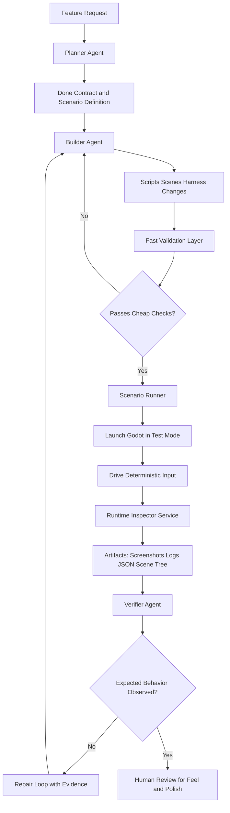

# Agentic Godot Validation Plan

## Goal

Build a highly agentic Godot development workflow where an AI can plan and implement features, but cannot claim a feature is complete unless it produces evidence from a running game session.

This setup is meant to close the gap between code that looks complete and gameplay that actually works.

## Core Idea

The central problem is that an agent can inspect scripts and scenes, but many Godot failures only show up at runtime:

- UI appears behind the wrong layer
- Signals are connected incorrectly or never fire
- Collision masks prevent interaction
- Pause mode or focus behavior breaks input
- A dialog opens in code, but is not actually usable in the game

Because of that, unit tests are useful but insufficient on their own. The missing layer is a deterministic gameplay scenario test that the agent can set up, run, observe, and validate.

The workflow should be built around evidence, not source-level confidence.

## High-Level Architecture

The recommended system has six parts:

1. Planner agent
   Turns a feature request into a precise done contract, identifies touched scenes and scripts, and defines the validation scenario.
2. Builder agent
   Implements scripts, scenes, and harness assets, but does not get to declare success.
3. Fast validation layer
   Runs static checks, unit tests, and scene smoke tests to catch cheap failures early.
4. Scenario runner
   Launches Godot in a controlled test mode, loads a harness scene or target scene, drives deterministic input, and collects artifacts.
5. Runtime inspector service
   A development-only autoload that exposes machine-checkable runtime facts from the running game.
6. Verifier agent
   Reads the artifacts and decides whether expected behavior actually occurred.

Humans stay in the loop, but only for things automation is bad at judging: feel, pacing, readability, polish, juice, and fun.

## Validation Pyramid

Use multiple layers, each solving a different class of failure:

1. Static checks
   Syntax, style, obvious project errors.
2. Unit tests
   Dialog graphs, interaction rules, state machines, save/load logic, utility code.
3. Scene smoke tests
   Can the scene load, instantiate, and find required nodes, resources, and connections?
4. Gameplay scenario tests
   Does the interaction actually work in a running game under deterministic conditions?

The fourth layer is the one that makes agentic iteration reliable.

## Runtime Inspector

The runtime inspector is the key enabler. It should be available only in development and test contexts, not in production builds.

It should expose at least the following runtime facts:

- whether a node exists
- whether a node is visible
- whether a node is inside the expected canvas or modal stack
- which control currently has focus
- whether gameplay input is currently enabled or suppressed
- whether relevant signals fired
- collision or overlap facts for interactable objects
- a scene tree snapshot
- a warning and error log snapshot
- screenshot capture at named checkpoints
- a compact JSON summary of observed state

This is what lets the agent reason about hidden UI, wrong z-order, missing focus, disconnected signals, wrong collision masks, and similar runtime-only bugs.

## Harness Scenes

Do not test everything only through the full game. Create deterministic harness scenes for important interactions.

Harness scenes should:

- place required actors and UI in known positions
- remove unrelated systems that add noise
- preload required resources
- start from a fixed, reproducible initial state
- support scripted input sequences

For example, an NPC dialog harness scene might include only:

- player character
- one NPC
- dialog UI root
- minimal camera and environment
- interaction controller
- test-only inspector hooks

This makes failures easier for the agent to isolate and repair.

## Scenario Runner

The scenario runner should be invokable from the command line so an agent can use it in an automated loop.

The runner should:

1. launch Godot in a test mode
2. load a harness scene or target scene
3. apply a deterministic sequence of inputs and waits
4. ask the runtime inspector for checkpoints
5. capture screenshots and summary artifacts
6. exit with a machine-readable pass or fail result

Each scenario should produce artifacts like:

- summary.json
- scene_tree.json
- event_log.json
- console.log
- checkpoint screenshots

The runner should treat missing artifacts as failure.

## Verifier Loop

The agent loop should look like this:

1. Planner agent defines the done contract and scenario.
2. Builder agent implements the change.
3. Fast checks run first.
4. Scenario runner launches the game and performs the interaction.
5. Runtime inspector captures evidence.
6. Verifier agent compares expected versus observed behavior.
7. If the scenario fails, the next repair loop uses the artifacts instead of guessing from code.
8. If the scenario passes, the feature is ready for human review.

This makes the workflow highly agentic without letting the builder grade its own homework.

## Mermaid Diagram

## Example: NPC Dialog Interaction

For an NPC dialog feature, the scenario definition should make the expected behavior explicit.

### Done Contract

- when the player enters range and presses interact, the dialog opens
- the dialog root exists in the scene tree
- the dialog is visible on screen
- the dialog is in the expected UI layer or modal state
- a dialog control has focus
- gameplay movement input is blocked while the dialog is open
- closing the dialog restores gameplay control

### Scenario Steps

1. load the NPC dialog harness scene
2. place the player in interaction range
3. send the interact input
4. wait a fixed number of frames
5. assert dialog node exists
6. assert dialog is visible
7. assert focus is on the expected control
8. assert gameplay input is suppressed
9. capture a screenshot
10. send the close input
11. assert gameplay control returns

This is much stronger than simply checking whether a signal is connected or a dialog node was instantiated.

## Recommended Rollout

The safest rollout is incremental:

### Phase 1

- add static checks
- add unit tests with GUT or WAT
- add harness scenes for two or three core interactions

### Phase 2

- add the runtime inspector autoload
- add scenario definitions
- add a command-line scenario runner

### Phase 3

- add artifact-based verifier logic
- wire the workflow into local tasks and CI smoke packs
- require evidence before the agent can claim success

### Phase 4

- expand scenario coverage
- optionally add visual diffing if the project justifies it
- add broader slice tests for real gameplay scenes

## Tooling Opinion

GUT is usually the safer default for unit testing because it is mature and widely used. But the important investment is not the unit test framework itself. The real leverage comes from the custom scenario layer and runtime observability.

Start with runtime assertions plus screenshots for debugging. Do not begin with strict screenshot-diff gating unless you already know your UI and rendering pipeline are stable enough to support it.

## Rules for Agent Completion

The agent should not be allowed to say a feature works unless:

1. fast checks passed
2. the relevant gameplay scenario ran successfully
3. required artifacts were produced
4. runtime assertions matched the done contract

A missing screenshot, missing summary file, runtime error, or assertion mismatch should count as failure.

## What This Solves

This setup is specifically designed to catch problems like:

- dialog exists but is hidden
- dialog exists but is behind the world layer
- interact signal is wired but never fires in practice
- player cannot enter the interaction zone because collision masks are wrong
- dialog opens but never receives focus
- gameplay input still leaks through while a modal is open
- a feature works in an isolated script test but fails in a real scene

## What It Does Not Solve

This setup does not remove the need for human judgment in areas like:

- game feel
- pacing
- readability of UI or narrative
- balance
- fun
- visual polish

The goal is not full autonomy in a broad sense. The goal is constrained autonomy with a hard evidence gate.

## Summary

The practical shape of an agentic Godot workflow is:

- agents can plan and build features
- the game exposes runtime facts in test mode
- a scenario runner can launch and drive the game deterministically
- a verifier agent decides pass or fail based on artifacts
- humans only review what automation cannot judge well

If this is built well, the AI stops saying "the code is complete" and starts saying "the scenario passed, here is the screenshot and runtime summary proving it."